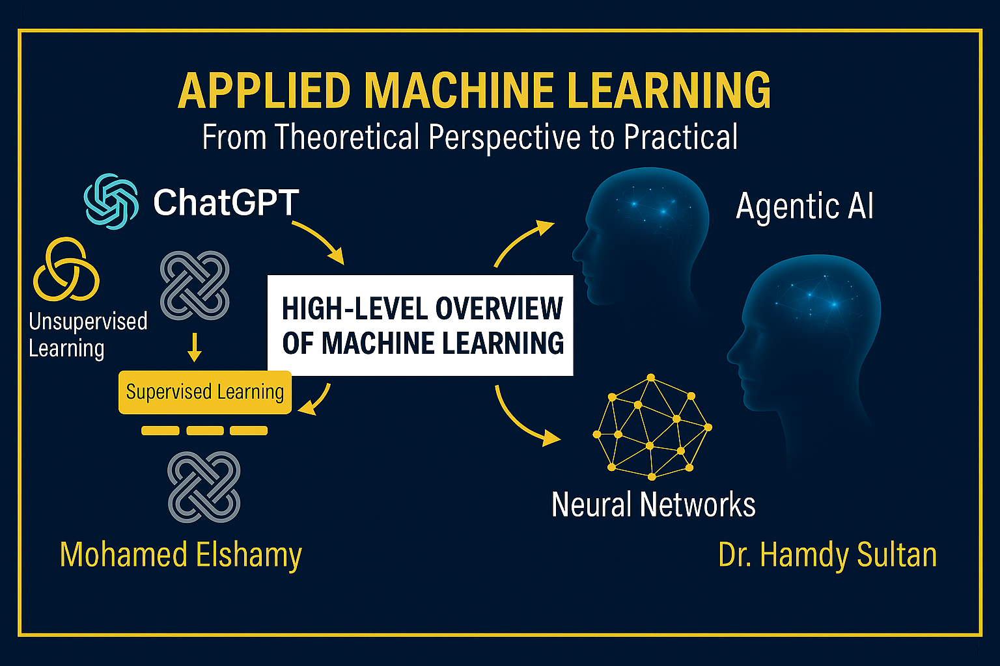

# Machine Learning Course 2025 🚀

Welcome to the comprehensive Machine Learning Course 2025! This course provides a complete journey through machine learning and deep learning, from fundamental concepts to advanced applications.

## 📚 Based on the Book

<div align="center">


**Machine Learning with PyTorch and Scikit-Learn**  
*Develop machine learning and deep learning models with Python*

**Authors**: Sebastian Raschka, Yuxi (Hayden) Liu, Vahid Mirjalili  
**Publisher**: Packt Publishing  
**Link**: [📖 Book Details](https://sebastianraschka.com/blog/2022/ml-pytorch-book.html)

</div>

## 🎯 Course Overview

This comprehensive course covers **19 chapters** of machine learning and deep learning concepts with a **modern AI-powered approach**:

### 🤖 **Unique Learning Approach with AI Agents**
- **Early chapters (1-6)**: Learn fundamentals through **manual coding** to understand concepts deeply
- **Later chapters (7-19)**: Leverage **AI Agents** for efficient development and implementation
- **Best of both worlds**: Solid theoretical foundation + modern AI-assisted programming

### 🐳 **Production-Ready Skills**
- **Docker & Containers**: Learn to containerize ML applications for scalable deployment
- **GPU Optimization**: Master efficient GPU utilization for deep learning workloads
- **Cloud Computing**: Deploy models using modern cloud infrastructure
- **MLOps Practices**: Version control, monitoring, and automated pipelines

**Part 1: Machine Learning Fundamentals (Chapters 1-10)**
- Machine learning basics, terminology, and notation
- Data preprocessing and feature engineering
- Classification algorithms (Perceptron, Logistic Regression, SVM, Decision Trees)
- Model evaluation, validation, and hyperparameter tuning
- Dimensionality reduction techniques
- Ensemble methods and boosting algorithms

**Part 2: Deep Learning with PyTorch (Chapters 11-19)**
- Neural networks from scratch and backpropagation
- Deep learning with PyTorch fundamentals
- Convolutional Neural Networks (CNNs) for image classification
- Recurrent Neural Networks (RNNs) for sequential data
- **Transformers and Attention Mechanisms** for NLP
- **Graph Neural Networks** for graph-structured data
- Generative Adversarial Networks (GANs)
- Reinforcement Learning basics

## 📋 Prerequisites

- **Basic programming knowledge** (any language)
- **No prior ML experience required** - we'll learn everything together!
- Enthusiasm to learn and practice

## 🎥 Complete Course Playlist

**[📺 Watch Full Course on YouTube](https://www.youtube.com/playlist?list=PLZ42ZUInDWC7lCjsGUSd8RItbCZ6KESG9)**

## 📖 Course Materials

| Chapter | Topic | Source Code | YouTube Video | Resources |
|---------|-------|-------------|---------------|-----------|
| **Ch 1** | Introduction to Machine Learning | [📁 Code](./scripts/chapter01/) | [🎥 Watch](https://www.youtube.com/playlist?list=PLZ42ZUInDWC7lCjsGUSd8RItbCZ6KESG9) | [📚 PDF](./pdfs/chapter01.pdf) |
| **Ch 2** | Training Simple ML Algorithms | [📁 Code](./scripts/chapter02/) | [🎥 Watch](https://www.youtube.com/playlist?list=PLZ42ZUInDWC7lCjsGUSd8RItbCZ6KESG9) | [📚 PDF](./pdfs/chapter02.pdf) |
| **Ch 3** | Classification with Scikit-Learn | [📁 Code](./scripts/chapter03/) | [🎥 Watch](https://www.youtube.com/playlist?list=PLZ42ZUInDWC7lCjsGUSd8RItbCZ6KESG9) | [📚 PDF](./pdfs/chapter03.pdf) |
| **Ch 4** | Data Preprocessing | [📁 Code](./scripts/chapter04/) | [🎥 Watch](https://www.youtube.com/playlist?list=PLZ42ZUInDWC7lCjsGUSd8RItbCZ6KESG9) | [📚 PDF](./pdfs/chapter04.pdf) |
| **Ch 5** | Dimensionality Reduction | [📁 Code](./scripts/chapter05/) | [🎥 Watch](https://www.youtube.com/playlist?list=PLZ42ZUInDWC7lCjsGUSd8RItbCZ6KESG9) | [📚 PDF](./pdfs/chapter05.pdf) |
| **Ch 6** | Model Evaluation & Hyperparameter Tuning | [📁 Code](./scripts/chapter06/) | [🎥 Watch](https://www.youtube.com/playlist?list=PLZ42ZUInDWC7lCjsGUSd8RItbCZ6KESG9) | [📚 PDF](./pdfs/chapter06.pdf) |
| **Ch 7** | Ensemble Learning & Random Forests | [📁 Code](./scripts/chapter07/) | [🎥 Watch](https://www.youtube.com/playlist?list=PLZ42ZUInDWC7lCjsGUSd8RItbCZ6KESG9) | [📚 PDF](./pdfs/chapter07.pdf) |
| **Ch 8** | Sentiment Analysis with Bag-of-Words | [📁 Code](./scripts/chapter08/) | [🎥 Watch](https://www.youtube.com/playlist?list=PLZ42ZUInDWC7lCjsGUSd8RItbCZ6KESG9) | [📚 PDF](./pdfs/chapter08.pdf) |
| **Ch 9** | Regression Analysis | [📁 Code](./scripts/chapter09/) | [🎥 Watch](https://www.youtube.com/playlist?list=PLZ42ZUInDWC7lCjsGUSd8RItbCZ6KESG9) | [📚 PDF](./pdfs/chapter09.pdf) |
| **Ch 10** | Clustering with K-Means | [📁 Code](./scripts/chapter10/) | [🎥 Watch](https://www.youtube.com/playlist?list=PLZ42ZUInDWC7lCjsGUSd8RItbCZ6KESG9) | [📚 PDF](./pdfs/chapter10.pdf) |
| **Ch 11** | Neural Networks from Scratch | [📁 Code](./scripts/chapter11/) | [🎥 Watch](https://www.youtube.com/playlist?list=PLZ42ZUInDWC7lCjsGUSd8RItbCZ6KESG9) | [📚 PDF](./pdfs/chapter11.pdf) |
| **Ch 12** | PyTorch Fundamentals | [📁 Code](./scripts/chapter12/) | [🎥 Watch](https://www.youtube.com/playlist?list=PLZ42ZUInDWC7lCjsGUSd8RItbCZ6KESG9) | [📚 PDF](./pdfs/chapter12.pdf) |
| **Ch 13** | Deep Learning with PyTorch | [📁 Code](./scripts/chapter13/) | [🎥 Watch](https://www.youtube.com/playlist?list=PLZ42ZUInDWC7lCjsGUSd8RItbCZ6KESG9) | [📚 PDF](./pdfs/chapter13.pdf) |
| **Ch 14** | Convolutional Neural Networks | [📁 Code](./scripts/chapter14/) | [🎥 Watch](https://www.youtube.com/playlist?list=PLZ42ZUInDWC7lCjsGUSd8RItbCZ6KESG9) | [📚 PDF](./pdfs/chapter14.pdf) |
| **Ch 15** | Recurrent Neural Networks | [📁 Code](./scripts/chapter15/) | [🎥 Watch](https://www.youtube.com/playlist?list=PLZ42ZUInDWC7lCjsGUSd8RItbCZ6KESG9) | [📚 PDF](./pdfs/chapter15.pdf) |
| **Ch 16** | Transformers & Attention 🔥 | [📁 Code](./scripts/chapter16/) | [🎥 Watch](https://www.youtube.com/playlist?list=PLZ42ZUInDWC7lCjsGUSd8RItbCZ6KESG9) | [📚 PDF](./pdfs/chapter16.pdf) |
| **Ch 17** | Graph Neural Networks 🔥 | [📁 Code](./scripts/chapter17/) | [🎥 Watch](https://www.youtube.com/playlist?list=PLZ42ZUInDWC7lCjsGUSd8RItbCZ6KESG9) | [📚 PDF](./pdfs/chapter17.pdf) |
| **Ch 18** | Generative Adversarial Networks | [📁 Code](./scripts/chapter18/) | [🎥 Watch](https://www.youtube.com/playlist?list=PLZ42ZUInDWC7lCjsGUSd8RItbCZ6KESG9) | [📚 PDF](./pdfs/chapter18.pdf) |
| **Ch 19** | Reinforcement Learning | [📁 Code](./scripts/chapter19/) | [🎥 Watch](https://www.youtube.com/playlist?list=PLZ42ZUInDWC7lCjsGUSd8RItbCZ6KESG9) | [📚 PDF](./pdfs/chapter19.pdf) |

## 🛠️ Tools & Technologies

### **Core ML Stack**
- **Python** - Primary programming language
- **PyTorch** - Deep learning framework
- **Scikit-Learn** - Machine learning library
- **NumPy & Pandas** - Data manipulation
- **Matplotlib & Seaborn** - Data visualization
- **Jupyter Notebooks** - Interactive development

### **AI-Powered Development**
- **AI Agents** - Cursor, GitHub Copilot, ChatGPT for code assistance
- **Code Generation** - Automated boilerplate and implementation
- **Debugging & Optimization** - AI-assisted troubleshooting

### **Production & Deployment**
- **Docker** - Containerization for reproducible environments
- **NVIDIA Docker** - GPU-accelerated containers
- **CUDA & cuDNN** - GPU optimization for deep learning
- **Cloud Platforms** - AWS, Google Cloud, Azure deployment
- **MLOps Tools** - Git, DVC, MLflow for model versioning

## 📁 Repository Structure

```
├── scripts/           # Python code for each chapter
├── pdfs/             # PDF materials and notes
├── resources/        # Additional learning resources
├── youtube-videos/   # Video-related materials
└── README.md         # This file
```

## 🚀 How to Use This Repository

### **Learning Path**
1. **Watch the YouTube videos** for theoretical understanding
2. **Early chapters (1-6)**: Code manually to build strong fundamentals
3. **Later chapters (7-19)**: Use AI Agents to accelerate development
4. **Review the PDF materials** for detailed explanations
5. **Practice with Docker containers** for deployment skills

### **AI-Powered Learning Approach**
- **Foundation First**: Master core concepts through hands-on coding
- **AI Acceleration**: Use AI agents for complex implementations
- **Production Ready**: Learn Docker, GPU optimization, and deployment
- **Real-World Skills**: Combine theoretical knowledge with modern tools

## 🔗 Additional Resources

- [📖 Official Book Page](https://sebastianraschka.com/blog/2022/ml-pytorch-book.html)
- [🎥 Complete YouTube Playlist](https://www.youtube.com/playlist?list=PLZ42ZUInDWC7lCjsGUSd8RItbCZ6KESG9)
- [💻 Book's Official GitHub Repository](https://github.com/rasbt/machine-learning-book)
- [🐍 PyTorch Documentation](https://pytorch.org/docs/)
- [📊 Scikit-Learn Documentation](https://scikit-learn.org/)

## 👨‍🏫 About the Instructor

This course is taught by **Mohamed Elshamy**, providing comprehensive explanations and practical implementations of machine learning concepts.

## 🤝 Contributing

Feel free to contribute by:
- Reporting issues or bugs
- Suggesting improvements
- Adding supplementary materials
- Sharing your projects

## 📜 License

This educational content is provided for learning purposes. Please respect the original book's copyright and licensing terms.

---

**⭐ If you find this course helpful, please star this repository and subscribe to the YouTube channel!**

**Happy Learning! 🎓**